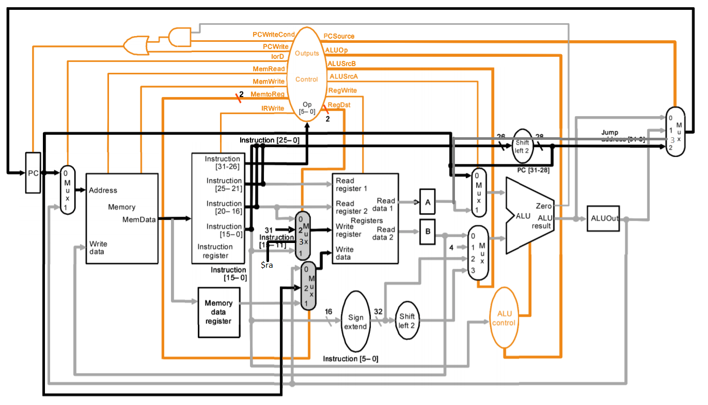

# MIPS_MultiCycle

## 1. MIPS指令集

### 1.1 实现的指令集

```assembly
add     $rd, $rs, $rt                   # [rd] = [rs] + [rt]
sub     $rd, $rs, $rt                   # [rd] = [rs] - [rt]
and     $rd, $rs, $rt                   # [rd] = [rs] & [rt]
or      $rd, $rs, $rt                   # [rd] = [rs] | [rt]
slt     $rd, $rs, $rt                   # [rd] = [rs] < [rt] ? 1 : 0
addi    $rt, $rs, imm                   # [rt] = [rs] + SignImm
andi    $rt, $rs, imm                   # [rt] = [rs] & ZeroImm
ori     $rt, $rs, imm                   # [rt] = [rs] | ZeroImm
slti    $rt, $rs, imm                   # [rt] = [rs] < SignImm ? 1 : 0
lw      $rt, imm($rs)                   # [rt] = [Address]
sw      $rt, imm($rs)                   # [Address] = [rt]
j       label                           # PC = JTA
jal     label                           # [ra] = PC + 4, PC = JTA
jr      $rs                             # PC = [rs]
beq     $rs, $rt, label                 # if ([rs] == [rt]) PC = BTA
```

其中，主要扩展了J类型指令，完成了`JAL`和`JR`指令，使得程序的跳转更加完整，能够保存当前指令的下一条指令的地址，从而完成`return`的操作。

## 2. 部件构成

这一部分介绍与单周期MIPS不同的部件

### 2.1 mem

在多周期实现中，指令存储器和数据存储器被合并，mem部件能够从寄存器中取指，以及读写数据。在具体实现中，是通过一个`iord`信号去控制读取的地址是指令地址还是数据地址。

```verilog
module mem(
    input  logic        clk, we,
    input  logic [31:0] a, wd,
    output logic [31:0] rd
);
    logic [31:0] RAM[63:0];

    initial begin
        $readmemh("memfile.dat", RAM);
    end

    assign rd = RAM[a[31:2]];
    always_ff @(posedge clk) begin
        if (we)
            RAM[a[31:2]] <= wd;
    end
endmodule
```

### 2.2 floprenr

floprenr与原来的不同在于添加了使能信号，使得mips能够控制寄存器的内容是否改变。在单周期中，这样的改变通常是使用mux直接对其进行判断，但是多周期数据是随时钟周期改变的，因此需要信号去控制在该时钟周期中是否需要保存该数据。

```verilog
module floprenr #(parameter WIDTH = 8)(
    input  logic                clk, reset,
    input  logic                en,
    input  logic [WIDTH-1 : 0]  d,
    output logic [WIDTH-1 : 0]  q
);
    always_ff @(posedge clk, posedge reset)
    begin
        if (reset)   q <= 0;
        else if (en) q <= d;
    end
endmodule
```

### 2.3 与或门

在多周期中，因为可能当前指令未执行完但已经过了一个时钟周期，导致数据的流动，因此需要用一个与门一个或门去判断是否需要更新pc地址。

与门的实现，用于判断分支指令是否需要执行跳转pc。

```verilog
module ander(
    input  logic a, b,
    output logic s
);
    assign s = a & b;
endmodule
```

或门的实现，用于判断是否需要将pc替换为pcnext。

```verilog
module orer(
    input  logic a, b,
    output logic s
);
    assign s = a | b;
endmodule
```

### 2.4 mips

#### 2.4.1 controller

控制器与单周期的不同在于加入了state去进行控制信号的输出，每一条指令在执行的过程中如果有控制信号发生改变，则需要进行拆分，分为两个状态进行解码。这也就导致了解码器需要根据目前的状态去取得下一个状态的信息，该信息由next_state控制。而主解码器从原来的由op控制信号量的输出转变为由state控制；而next_state则由op进行控制。

控制器主要的改变在于主解码器。

```verilog
module maindec(
    input  logic        clk, reset,
    input  logic [5:0]  op,
    input  logic [5:0]  funct,
    output logic        pcwrite, memwrite, irwrite, regwrite,
    output logic        alusrca,
    output logic        branch,
    output logic        iord,
    output logic [1:0]  memtoreg,
    output logic [1:0]  regdst,
    output logic [1:0]  alusrcb,
    output logic [1:0]  pcsrc,
    output logic [2:0]  aluop
    );

    logic [3:0]  state, next_state;
    logic [17:0] controls;
    
    // reset logic
    always_ff @(posedge clk or posedge reset) begin
        if (reset)
            state <= 4'b0000;       // reset current state to FETCH
        else
            state <= next_state;    // set state to next state
    end

    // next state logic
    always_comb begin
        case(state)
            4'b0000: next_state = 4'b0001;                      // FETCH -> DECODE
            4'b0001: begin                                      // DECODE
                case (op)
                    6'b100011: next_state = 4'b0010;            // OP: LW; DECODE -> MEMADR
                    6'b101011: next_state = 4'b0010;            // OP: SW; DECODE -> MEMADR
                    6'b000000: begin                            // DECODE -> RTYPE
                        case(funct)
                            6'b001000: next_state = 4'b1110;    // OP: JR; DECODE -> JREX
                            default:   next_state = 4'b0110;    // OP: RTYPE; DECODE -> RTYPEEX
                        endcase
                    end
                    
                    6'b000100: next_state = 4'b1000;            // OP: BEQ; DECODE -> BEQEX
                    6'b001000: next_state = 4'b1001;            // OP: ADDI; DECODE -> ADDIEX
                    6'b000010: next_state = 4'b1011;            // OP: J; DECODE -> JEX
                    6'b001100: next_state = 4'b1100;            // OP: ANDI; DECODE -> ANDIEX
                    6'b000011: next_state = 4'b1111;            // OP: JAL; DECODE -> JALEX
                    default:   next_state = 4'bxxxx;
                endcase
            end
            4'b0010: begin                                      // MEMADR
                case (op)
                    6'b100011: next_state = 4'b0011;            // OP: LW; DECODE -> MEMRD
                    6'b101011: next_state = 4'b0101;            // OP: SW; DECODE -> MEMWR 
                    default:   next_state = 4'bxxxx;
                endcase
            end
            4'b0011: next_state = 4'b0100;                      // MEMRD -> MEMWB
            4'b0100: next_state = 4'b0000;                      // MEMWB -> FETCH
            4'b0101: next_state = 4'b0000;                      // MEMWR -> FETCH
            4'b0110: next_state = 4'b0111;                      // RTYPEEX -> RTYPEWB
            4'b0111: next_state = 4'b0000;                      // RTYPEWB -> FETCH
            4'b1000: next_state = 4'b0000;                      // BEQEX -> FETCH
            4'b1001: next_state = 4'b1010;                      // ADDIEX -> ADDIWB
            4'b1010: next_state = 4'b0000;                      // ADDIWB -> FETCH
            4'b1011: next_state = 4'b0000;                      // JEX -> FETCH
            4'b1100: next_state = 4'b1101;                      // ANDIEX -> ANDIWB
            4'b1101: next_state = 4'b0000;                      // ANDIWB -> FETCH
            4'b1110: next_state = 4'b0000;                      // JREX -> FETCH
            4'b1111: next_state = 4'b0000;                      // JALEX -> FETCH
            default: next_state = 4'bxxxx;
        endcase
    end

    // assign output to controls
    assign {pcwrite,
            memwrite,
            irwrite,
            regwrite, 
            alusrca,
            branch,
            iord,
            memtoreg,
            regdst, 
            alusrcb,
            pcsrc,
            aluop} = controls;

    // output logic
    always_comb begin
        case (state)
            4'b0000: controls = 18'b1010000_00_00_01_00_000;  // FETCH
            4'b0001: controls = 18'b0000000_00_00_11_00_000;  // DECODE
            4'b0010: controls = 18'b0000100_00_00_10_00_000;  // MEMADR
            4'b0011: controls = 18'b0000001_00_00_00_00_000;  // MEMRD
            4'b0100: controls = 18'b0001000_01_00_00_00_000;  // MEMWB
            4'b0101: controls = 18'b0100001_00_00_00_00_000;  // MEMWR
            4'b0110: controls = 18'b0000100_00_00_00_00_010;  // RTYPEEX
            4'b0111: controls = 18'b0001000_00_01_00_00_000;  // RTYPEWB
            4'b1000: controls = 18'b0000110_00_00_00_01_001;  // BEQEX
            4'b1001: controls = 18'b0000100_00_00_10_00_000;  // ADDIEX
            4'b1010: controls = 18'b0001000_00_00_00_00_000;  // ADDIWB
            4'b1011: controls = 18'b1000000_00_00_00_10_000;  // JEX
            4'b1100: controls = 18'b0000100_00_00_10_00_100;  // ANDIEX
            4'b1101: controls = 18'b0001000_00_00_00_00_000;  // ANDIWB
            4'b1110: controls = 18'b1000000_00_00_00_11_000;  // JREX
            4'b1111: controls = 18'b1001100_10_10_00_10_000;  // JALEX
            default: controls = 18'hxxxx;
        endcase
    end
endmodule
```

输出的控制信号：

- pcwrite：用于控制是否需要将`pcnext`赋给`pc`，主要由`FETCH`, `JEX`, `JREX`, `JALEX`等状态去控制
- memwrite：用于控制是否写入内存，由`MEMWR`状态控制，只有`MEMWR`状态需要写入内存
- irwrite：用于控制指令寄存器的写入，由`FETCH`状态控制，只有`FETCH`状态需要写入指令寄存器
- regwrite：用于控制数据寄存器的写入，由`MEMWB`状态控制，只有`MEMWB`状态需要写数据寄存器
- alusrca：用于控制alu的输入`A`是`pc`还是寄存器文件读到的数据，与`ADDIEX`以及各种跳转和分支指令有关
- branch：分支信号，和zero一起判断是否执行跳转命令
- iord：用于判断读指令还是读数据
- memtoreg：用于判断写入寄存器的内容：
  - 00：写入`aluout`中的数据，即alu的输出
  - 01：写入读到的数据，即regfile的输出
  - 10：写入pc，是`JAL`的需求，需要向寄存器写入pc
- regdst：用于判断目标寄存器地址：
  - 00：instr[20:16]
  - 01：instr[15:11]
  - 10：`$ra`，也是`JAL`的需求，需要向`$ra`寄存器写入pc
- alusrcb：用于控制alu的输入`A`是`pc`还是寄存器文件读到的数据：
  - 00：寄存器文件读到的数据
  - 01：4，用于计算顺序执行的`pcnext`
  - 10：立即数符号扩展
  - 11：立即数符号扩展并左移两位
- pcsrc：用于控制`pcnext`的地址
  - 00：`aluresult`，即顺序执行的地址
  - 01：`aluout`，即分支指令计算得到的地址
  - 10：跳转地址，由指令以及立即数左移得到
  - 11：跳转地址，从寄存器文件中读到，为`JR`指令的功能，通常都是读取`$ra`寄存器中的内容
- aluop：输出到alu解码器中，提供运算操作符，与单周期完全相同

#### 2.4.2 datapath

加入了`JAL`和`JR`指令的数据路径图如下，与书本上的不同在于加入了jump指令的一些数据路径。多周期的数据路径与单周期最大的不同在于部件的输出需要遵守时序，例如：alu部件的输出需要寄存器去保存上一时钟周期的结果。结果就是多周期的数据路径相较于单周期多出了很多寄存器，但这样的结构不需要加法器就能够实现下一条pc地址的计算，减少了很多部件空间。



```verilog
module datapath(
    input  logic        clk, reset, 
    input  logic        pcwrite, memwrite, irwrite, regwrite,
    input  logic        alusrca, branch, iord,  
    input  logic [1:0]  memtoreg, regdst, alusrcb, pcsrc,
    input  logic [2:0]  alucontrol,
    output logic        zero,
    output logic [31:0] pc,
    output logic [31:0] instr,
    input  logic [31:0] readdata,
    output logic [31:0] adr, b
    );

    logic pcen, ifbranch;
    logic [4:0]  rfwa3;
    logic [31:0] pcnext, aluout, data, rfwd3, rfrd1, rfrd2, a, srca, srcb, signimm, signimmsh, aluresult;
    
    floprenr #(32)      pcreg(clk, reset, pcen, pcnext, pc);
    mux2 #(32)          pcregmux(pc, aluout, iord, adr);
    floprenr #(32)      readdatareg(clk, reset, irwrite, readdata, instr);
    flopr #(32)         rfwdreg(clk, reset, readdata, data);
    mux4 #(5)           regdstmux(instr[20:16], instr[15:11], 5'b11111, 'x, regdst, rfwa3);
    mux4 #(32)          mem2regmux(aluout, data, pc, 'x, memtoreg, rfwd3);
    regfile             rf(clk, regwrite, instr[25:21], instr[20:16], rfwa3, rfwd3, rfrd1, rfrd2);
    floprdouble #(32)   rfreg(clk, reset, rfrd1, rfrd2, a, b);
    signext             se(instr[15:0], signimm);
    sl2                 immsh(signimm, signimmsh);
    mux2 #(32)          srcamux(pc, a, alusrca, srca);
    mux4 #(32)          srcbmux(b, 4, signimm, signimmsh, alusrcb, srcb);
    alu                 alu(srca, srcb, alucontrol, aluresult, zero);
    flopr #(32)         resreg(clk, reset, aluresult, aluout);
    mux4 #(32)          pcsrcreg(aluresult, aluout, {pc[31:28], instr[25:0], 2'b00}, a, pcsrc, pcnext);
    ander               ad(branch, zero, ifbranch);
    orer                oe(pcwrite, ifbranch, pcen);
endmodule
```

## 3. 实验结果

### 3.1 基础实验结果


### 3.2 测试JAL与JR指令的正确性

采用的测试方法与单周期一致


指令从`JAL`指令处跳转到`JR`指令处，再从`JR`指令处跳转回原来`JAL`指令的下一条指令，完成跳转的测试。